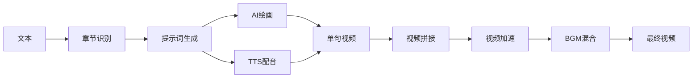

# 🎬 开源了一个AI视频创作平台，100句视频成本只要6元

## 前言

大家好！今天给大家分享一个我最近开源的项目 —— **AICG智能视频创作平台**。

这是一个能将长文本自动转换为高质量图文解说视频的工具，最大的特点是：**成本低、效率高、全自动**。

**GitHub**: https://github.com/869413421/aicon

---

## 💡 为什么做这个项目？

作为内容创作者，我们都知道：
- 📝 **文字内容**阅读量越来越低
- 📺 **视频内容**才是流量密码
- 💰 **传统视频制作**成本太高（500-2000元/条）
- ⏰ **自己剪辑**太费时间（2-3天/条）

于是我想：**能不能用AI自动化这个过程？**

经过几个月的开发，答案是：**可以，而且成本低到惊人！**

---

## 📺 产品演示

### 完整工作流程

#### 1️⃣ 项目管理与章节识别


**功能**：
- 上传TXT、DOCX、PDF、EPUB等格式文档
- AI自动识别章节结构
- 可视化编辑器调整章节

---

#### 2️⃣ 导演引擎 - 批量生成素材


**功能**：
- 批量生成AI绘画提示词
- 调用AI模型生成图片
- TTS语音合成
- 实时预览素材

---

#### 3️⃣ 单句精细调整


**功能**：
- 查看每句话的详细信息
- 重新生成不满意的图片或音频
- 一键替换素材

---

#### 4️⃣ 视频合成与配置


**功能**：
- 配置视频参数（分辨率、帧率、字幕样式）
- 选择BGM并调节音量
- 设置视频速度
- 启用LLM字幕纠错
- 一键生成最终视频

---

## 💰 成本分析

这是最让人兴奋的部分！

### 实测成本（100句视频）

| 项目 | 服务 | 成本 |
|------|------|------|
| 提示词生成 | GPT-4o-mini | ¥0.1 |
| 图片生成 | Sora_Image（中转） | ¥4.0 |
| 语音合成 | 硅基流动TTS | ¥2.0 |
| **总计** | - | **¥6.1** |

### 成本对比

| 方式 | 成本 | 时间 | 技能要求 |
|------|------|------|---------|
| **传统外包** | ¥500-2000 | 3-7天 | 无 |
| **自己制作** | 时间成本 | 2-3天 | 剪辑、配音 |
| **本平台** | **¥6** | **10分钟** | **会点鼠标** |

**成本降低98%，效率提升300倍！**

---

## ✨ 核心功能

### 🎯 全自动化流程

```
上传文章 → AI识别章节 → 批量生成素材 → 自动合成视频 → 下载成品
```

**全程只需要点几下鼠标，其他全部自动化！**

### 🎨 AI素材生成

**图片生成**：
- Flux系列模型（高质量）
- SDXL系列模型（平衡）
- Sora_Image（低成本，约0.04元/张）

**语音合成**：
- 硅基流动 index-tts2
- 情感丰富的中文配音
- 自然流畅的语音节奏

**LLM集成**：
- GPT-4o系列
- Claude 3.5系列
- DeepSeek系列
- 智能字幕纠错

### 🎬 专业视频控制

| 功能 | 说明 |
|------|------|
| **Ken Burns效果** | 动态缩放+平移，告别静态画面 |
| **BGM混合** | 背景音乐自动循环，可调音量(0-50%) |
| **视频加速** | 0.5x-2.0x速度调整，保持音调不变 |
| **LLM字幕纠错** | 智能修正语音识别错误 |
| **多分辨率** | 竖屏/横屏/方形，适配各平台 |

### 💾 智能缓存

- 已生成的图片和音频自动复用
- 修改文案不需要重新生成所有素材
- 大幅节省API费用

---

## 🛠️ 技术架构

### 后端技术栈
```
FastAPI + SQLAlchemy + Celery + PostgreSQL + Redis + MinIO
```

- **FastAPI**: 高性能异步Web框架
- **Celery**: 分布式异步任务队列
- **PostgreSQL**: 主数据库
- **Redis**: 缓存与消息队列
- **MinIO**: 对象存储

### 前端技术栈
```
Vue 3 + Element Plus + Pinia + Vite
```

- **Vue 3**: 渐进式JavaScript框架
- **Element Plus**: 企业级UI组件库
- **Pinia**: 状态管理

### 核心技术流程



---

## 🚀 快速开始

### 环境要求

- Python 3.11+
- Node.js 18+
- FFmpeg
- Docker

### 一键启动

```bash
# 1. 克隆仓库
git clone https://github.com/869413421/aicon.git
cd aicon

# 2. 配置环境变量
cp .env.example .env
# 编辑.env，填入API密钥等配置

# 3. 启动基础设施
./scripts/start.sh

# 4. 启动后端（新终端）
cd backend
uv sync
alembic upgrade head
uv run uvicorn src.main:app --reload

# 5. 启动Celery（新终端）
cd backend
uv run celery -A src.tasks.celery_app worker --loglevel=info

# 6. 启动前端（新终端）
cd frontend
npm install
npm run dev
```

### 访问地址

- 前端：http://localhost:3000
- API文档：http://localhost:8000/docs
- MinIO控制台：http://localhost:9001

---

## 🎯 适用场景

### 内容创作者
- 📚 **小说解说**：网文、轻小说转视频
- 📖 **知识科普**：教程、百科转视频
- 📰 **新闻资讯**：快速制作新闻视频
- 🎭 **故事讲述**：历史故事、传说故事

### 企业用户
- 💼 **营销内容**：产品介绍、品牌故事
- 📊 **培训视频**：企业培训、课程制作
- 📢 **宣传视频**：活动宣传、公告通知

### 开发者
- 🔧 学习AI应用开发
- 🎨 了解视频处理技术
- 🚀 基于此开发自定义产品

---

## 💡 技术亮点

### 1. 字幕同步保护
- 严格验证LLM纠错词数
- 防止时间轴错位
- 确保音画完美同步

### 2. 高效加速策略
- 在最终视频应用速度
- 避免单句重复编码
- 大幅提升处理效率

### 3. 智能BGM处理
- 自动循环短BGM
- 自动截断长BGM
- 完美融合背景音乐

### 4. 增量缓存机制
- 智能复用已生成素材
- 修改文案只重新生成变化部分
- 节省API费用

---

## 🔮 未来规划

### 短期（Q1 2025）
- 👤 **人物一致性**：保持角色形象稳定（LoRA微调）
- 🎬 **动态视频**：集成Runway、Pika等视频生成模型
- 📹 **智能运镜**：电影级镜头语言

### 中期（Q2-Q3 2025）
- 🎨 **可视化编排**：时间轴编辑器，所见即所得
- 📤 **多平台发布**：一键发布到B站、抖音、YouTube
- 📊 **数据分析**：播放量统计、热度预测

### 长期（Q4 2025）
- 🤖 **AI音乐生成**：自动创作BGM
- 🎭 **表情动画**：角色表情生成
- 👥 **团队协作**：多人协同创作

---

## 🙋 常见问题

### Q: 需要GPU吗？
A: 不需要！所有AI计算都调用云端API，普通电脑就能跑。

### Q: API费用贵吗？
A: 非常便宜！100句视频只要6块钱，比买杯咖啡还便宜。

### Q: 支持哪些语言？
A: 目前主要支持中文，未来会支持多语言。

### Q: 视频质量如何？
A: 取决于你选择的AI模型。用好的模型（如Flux），质量非常高。

### Q: 可以商用吗？
A: 可以！MIT协议，随便用。但注意API服务商的使用条款。

### Q: 需要什么技术背景？
A: 会用Docker和命令行就行，有详细的安装文档。

---

## 📊 项目数据

- ⭐ **开源协议**：MIT（完全免费）
- 🔧 **开发语言**：Python + JavaScript
- 📦 **代码规模**：~20,000行
- ⚡ **性能**：单机可同时处理10+视频任务
- 💾 **存储**：支持MinIO对象存储
- 🌟 **GitHub Stars**：持续增长中

---

## 🌟 为什么选择这个项目？

### 1. 真正的低成本
不是营销噱头，是实测数据：**100句视频¥6**

### 2. 完全开源
MIT协议，代码完全开放，随便用，随便改

### 3. 持续更新
活跃开发中，功能持续增加，bug及时修复

### 4. 社区支持
欢迎提Issue、PR，一起让项目更好

### 5. 生产可用
不是Demo，是真正可以用于生产的完整系统

---

## 🤝 参与贡献

欢迎各种形式的贡献：

- ⭐ **Star**: 给项目点个星
- 🐛 **Issue**: 报告问题和建议
- 🔀 **PR**: 提交代码改进
- 💬 **讨论**: 分享使用心得
- 📢 **推广**: 推荐给更多人

---

## 📞 联系方式

- 📧 **GitHub**: https://github.com/869413421/aicon
- 💬 **Issues**: https://github.com/869413421/aicon/issues
- 📖 **文档**: 详见README

---

## 🎉 结语

这个项目凝聚了我几个月的心血，从构思到实现，踩了无数坑。

但看到它真的能帮助大家**低成本、高效率**地创作视频，一切都值得！

**AI正在改变内容创作的方式，而我们正站在这个变革的起点。**

如果你也对AI视频创作感兴趣，欢迎：
- ⭐ Star这个项目
- 🔀 Fork并改进
- 💬 提Issue交流
- 📢 分享给更多人

让我们一起用AI，**让创作更简单，让好内容触达更多人！** 🚀

---

**#AI视频创作 #开源项目 #内容创作 #视频制作 #人工智能 #FastAPI #Vue3**

---

<div align="center">

**⭐ 觉得有用？给个Star支持一下！⭐**

**GitHub**: https://github.com/869413421/aicon

**让AI为创作赋能，让好内容遇见更多人！**

</div>
