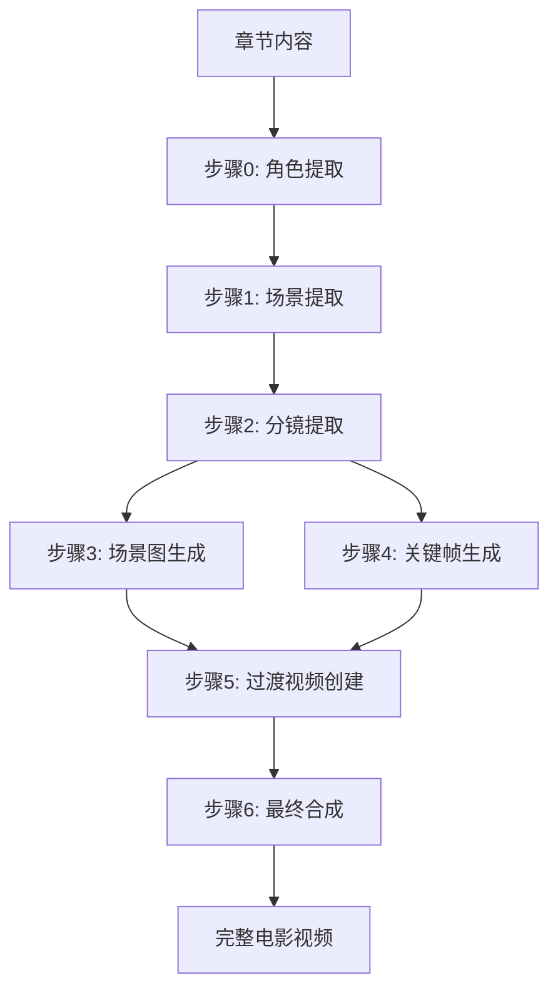

# 电影模块生成流程完整文档

## 概述

本文档详细描述了 AICON2 系统中电影模块的完整生成流程。该流程将小说章节内容转化为可用于视频生成的电影素材,包括角色、场景、分镜、关键帧、过渡视频等。

## 系统架构

### 技术栈
- **后端框架**: FastAPI + SQLAlchemy (异步)
- **任务队列**: Celery
- **AI模型**: 支持多种LLM和图像/视频生成模型
- **存储**: MinIO (对象存储)
- **数据库**: PostgreSQL

### 核心服务模块
- `MovieService`: 电影服务协调器
- `MovieCharacterService`: 角色提取与生成服务
- `SceneService`: 场景提取服务
- `StoryboardService`: 分镜提取服务
- `VisualIdentityService`: 视觉一致性服务(关键帧生成)
- `SceneImageService`: 场景图生成服务
- `TransitionService`: 过渡视频生成服务
- `MovieVideoService`: 最终合成服务

---

## 完整生成流程

电影生成流程分为 **7个主要步骤**,每个步骤都是独立的Celery任务:



---

## 步骤 0: 角色提取 (Character Extraction)

### 功能描述
从章节内容中提取所有主要角色,并为每个角色生成详细的特征描述。

### Celery任务
- **任务名称**: `movie.extract_characters`
- **文件位置**: `backend/src/tasks/movie.py`
- **服务类**: `MovieCharacterService`

### 工作流程
1. 加载章节内容
2. 调用LLM提取角色信息
3. 为每个角色生成三视图提示词
4. 保存角色到数据库

### 提取的角色信息
```json
{
  "name": "角色姓名",
  "era_background": "时代背景",
  "occupation": "职业或社会地位",
  "role_description": "角色身份、背景、性格",
  "visual_traits": "详细视觉特征描述",
  "key_visual_traits": ["核心特征1", "核心特征2", "核心特征3"],
  "dialogue_traits": "对话风格"
}
```

### 角色头像生成
- **任务名称**: `movie.generate_character_avatar`
- **生成方式**: 使用三视图提示词生成角色定妆照
- **输出**: 角色头像图片(存储到MinIO)

### 批量生成
- **任务名称**: `movie.batch_generate_avatars`
- **并发处理**: 同时生成多个角色头像

---

## 步骤 1: 场景提取 (Scene Extraction)

### 功能描述
将章节内容拆分为多个电影场景,每个场景对应一个明确的时间与空间。

### Celery任务
- **任务名称**: `movie.extract_scenes`
- **文件位置**: `backend/src/tasks/movie.py`
- **服务类**: `SceneService`

### 工作流程
1. 加载章节内容和项目角色列表
2. 调用LLM提取场景
3. 为每个场景标注出现的角色
4. 保存场景到MovieScript

### 场景数据结构
```json
{
  "order_index": 1,
  "scene": "高密度电影场景描述(包含环境、声音、角色行动、对话等)",
  "characters": ["角色名1", "角色名2"]
}
```

### 场景描述要求
- 包含环境与空间(地点、建筑、天气、光线)
- 包含声音要素(环境音、脚步声等)
- 包含角色行动(具体动作、位置变化)
- 包含冲突与张力
- 包含重要对话(用引号标出)
- 通过动作体现情绪(禁止心理独白)

---

## 步骤 2: 分镜提取 (Shot Extraction)

### 功能描述
将每个场景拆分为多个分镜头(Shot),每个分镜对应一个可独立成像的画面。

### Celery任务
- **任务名称**: `movie.extract_shots`
- **文件位置**: `backend/src/tasks/movie.py`
- **服务类**: `StoryboardService`

### 工作流程
1. 加载剧本的所有场景
2. 并发处理每个场景(最大并发数: 3)
3. 为每个场景调用LLM提取分镜
4. 保存分镜到数据库

### 分镜数据结构
```json
{
  "order_index": 1,
  "shot": "详细的分镜描述(人物动作、构图、光影、环境细节)",
  "dialogue": "角色对话内容",
  "characters": ["角色名1", "角色名2"]
}
```

### 分镜描述要求
- 人物位置与动作(肢体动作、表情、眼神)
- 构图与景别(特写、中景、全景、俯视、仰视)
- 光影与色调(光线方向、明暗对比)
- 环境细节(背景元素、道具)
- 对话内容(用引号标出)

---

## 步骤 3: 场景图生成 (Scene Image Generation)

### 功能描述
为每个场景生成环境建立镜头(Establishing Shot),展示场景的整体氛围。

### Celery任务
- **任务名称**: `movie.generate_scene_images`
- **文件位置**: `backend/src/tasks/movie.py`
- **服务类**: `SceneImageService`

### 工作流程
1. 加载剧本的所有场景
2. 并发生成场景图(最大并发数: 5)
3. 调用图像生成API
4. 上传图片到MinIO
5. 更新场景的scene_image_url

### 场景图特点
- **无人物**: 纯环境镜头,不包含任何人物
- **真实摄影**: 使用电影摄影机拍摄的效果
- **高质量**: 专业电影级别的画质
- **氛围营造**: 通过光线、天气、色调营造情绪

### 单个场景图生成
- **任务名称**: `movie.generate_single_scene_image`
- **支持自定义提示词**: 可覆盖默认生成的提示词

---

## 步骤 4: 关键帧生成 (Keyframe Generation)

### 功能描述
为每个分镜生成关键帧图片,作为视频生成的首尾帧。

### Celery任务
- **任务名称**: `movie.generate_keyframes`
- **文件位置**: `backend/src/tasks/movie.py`
- **服务类**: `VisualIdentityService`

### 工作流程
1. 加载剧本的所有分镜
2. 并发生成关键帧(最大并发数: 5)
3. 使用KeyframePromptBuilder构建专业提示词
4. 调用图像生成API
5. 上传图片到MinIO
6. 更新分镜的keyframe_url

### 关键帧提示词构建
- **使用Veo 3.1公式**: [Cinematography] + [Subject] + [Action] + [Context] + [Style]
- **角色一致性**: 引用角色的visual_traits确保外观一致
- **场景一致性**: 引用场景的环境描述
- **对话集成**: 如果有对话,添加字幕规范

### 单个关键帧生成
- **任务名称**: `movie.generate_single_keyframe`
- **支持自定义提示词**: 可覆盖默认生成的提示词

---

## 步骤 5: 过渡视频生成 (Transition Video Generation)

### 功能描述
为相邻的两个分镜生成过渡视频,实现流畅的镜头切换。

### 分为两个子步骤

#### 5.1 创建过渡记录
- **任务名称**: `movie.create_transitions`
- **服务类**: `TransitionService.batch_create_transitions`
- **工作流程**:
  1. 收集所有有关键帧的分镜
  2. 为相邻分镜对创建过渡记录
  3. 并发生成视频提示词(最大并发数: 5)
  4. 保存过渡记录到MovieShotTransition表

#### 5.2 生成过渡视频
- **任务名称**: `movie.generate_transition_videos`
- **服务类**: `TransitionService.batch_generate_transition_videos`
- **工作流程**:
  1. 查询所有pending状态的过渡
  2. 加载前后分镜的关键帧(转base64)
  3. 调用VectorEngine视频API
  4. 更新过渡状态为processing
  5. 记录video_task_id

#### 5.3 同步视频状态
- **任务名称**: `movie.sync_transition_video_status`
- **定时任务**: 定期同步视频生成状态
- **工作流程**:
  1. 查询所有processing状态的过渡
  2. 调用VectorEngine查询任务状态
  3. 如果completed,下载视频并上传到MinIO
  4. 更新过渡的video_url和status

### 过渡视频特点
- **首尾关键帧**: 使用前后分镜的关键帧作为视频的起止帧
- **流畅过渡**: AI模型生成中间帧实现平滑过渡
- **对话字幕**: 如果有对话,自动添加中文字幕
- **摄影运动**: 包含推拉摇移等镜头运动

---

## 步骤 6: 最终合成 (Movie Composition)

### 功能描述
将所有过渡视频拼接成完整的电影视频,可选添加BGM。

### Celery任务
- **任务名称**: `movie.compose_video`
- **文件位置**: `backend/src/tasks/movie_composition.py`
- **服务类**: `MovieVideoService`

### 工作流程
1. 获取章节的所有过渡视频
2. 验证视频完整性(确保所有过渡都已生成)
3. 并发下载过渡视频到本地
4. 使用FFmpeg拼接视频(**自动去除重复帧**)
5. 可选: 添加BGM音轨
6. 上传最终视频到MinIO
7. 更新VideoTask状态为completed

### 视频合成参数
- **视频编码**: H.264
- **音频编码**: AAC
- **分辨率**: 保持原始分辨率
- **帧率**: 保持原始帧率
- **重复帧处理**: 自动去除相邻过渡视频间的重复帧

### 重复帧优化

**问题**: 由于每个过渡视频使用相邻分镜的关键帧作为起止帧,在拼接时会导致关键帧重复出现。

**解决方案**: 
- 使用FFmpeg的`trim`和`atrim`滤镜
- 第一个视频保持完整
- 后续每个视频裁剪开头35帧(约1.5秒@24fps)
- 自动检测视频帧率,精确计算帧时长
- 保持音视频同步

**性能影响**:
- 处理时间增加约30-50%
- 使用`-crf 18`确保高质量输出
- 支持fallback到快速模式(不去重)
- 可通过`trim_frames`参数调整裁剪帧数

---

## Prompt模板管理

所有Prompt模板统一管理在 `backend/src/services/movie_prompts.py` 的 `MoviePromptTemplates` 类中。

### 主要Prompt模板

#### 1. 角色提取Prompt
- **方法**: `MovieCharacterService.EXTRACT_CHARACTERS_PROMPT`
- **输入**: 章节内容
- **输出**: JSON格式的角色列表
- **特点**: 
  - 强调角色名称一致性
  - 提取时代背景、职业、视觉特征
  - 生成对话风格描述

#### 2. 场景提取Prompt
- **方法**: `MoviePromptTemplates.get_scene_extraction_prompt`
- **输入**: 角色列表 + 章节内容
- **输出**: JSON格式的场景列表
- **特点**:
  - 高密度电影场景描述
  - 严格的角色名称约束
  - 包含环境、声音、动作、对话

#### 3. 分镜提取Prompt
- **方法**: `MoviePromptTemplates.get_shot_extraction_prompt`
- **输入**: 角色列表 + 场景描述
- **输出**: JSON格式的分镜列表
- **特点**:
  - 详细的画面描述
  - 包含构图、光影、动作
  - 分镜连贯性要求

#### 4. 场景图生成Prompt
- **方法**: `MoviePromptTemplates.get_scene_image_prompt`
- **输入**: 场景描述
- **输出**: 英文图像生成提示词
- **特点**:
  - 使用Veo 3.1公式
  - 强调无人物环境
  - 真实摄影风格

#### 5. 角色三视图Prompt
- **方法**: `CharacterThreeViewPromptBuilder.build_prompt`
- **输入**: 角色名称、时代背景、职业、视觉特征
- **输出**: 英文图像生成提示词
- **特点**:
  - 三视图一致性要求
  - 真人演员摄影风格
  - 禁止3D渲染/CGI

#### 6. 过渡视频Prompt
- **方法**: `MoviePromptTemplates.get_transition_video_prompt`
- **输入**: 前后两个分镜描述
- **输出**: 英文视频生成提示词
- **特点**:
  - 使用Veo 3.1五部分公式
  - 包含摄影运动描述
  - 对话字幕规范
  - 角色名称保护

---

## 数据模型

### MovieScript (剧本)
- `id`: UUID
- `chapter_id`: 关联章节
- `status`: 剧本状态(generating/completed/failed)
- `scenes`: 场景列表(一对多)

### MovieScene (场景)
- `id`: UUID
- `script_id`: 关联剧本
- `order_index`: 场景顺序
- `scene`: 场景描述
- `characters`: 出现的角色名称列表
- `scene_image_url`: 场景图URL
- `shots`: 分镜列表(一对多)

### MovieShot (分镜)
- `id`: UUID
- `scene_id`: 关联场景
- `order_index`: 分镜顺序
- `shot`: 分镜描述
- `dialogue`: 对话内容
- `characters`: 出现的角色名称列表
- `keyframe_url`: 关键帧图片URL

### MovieCharacter (角色)
- `id`: UUID
- `project_id`: 关联项目
- `name`: 角色名称
- `era_background`: 时代背景
- `occupation`: 职业
- `role_description`: 角色描述
- `visual_traits`: 视觉特征
- `key_visual_traits`: 核心视觉特征列表
- `dialogue_traits`: 对话风格
- `avatar_url`: 头像URL
- `generated_prompt`: 生成的三视图提示词

### MovieShotTransition (过渡视频)
- `id`: UUID
- `script_id`: 关联剧本
- `from_shot_id`: 起始分镜
- `to_shot_id`: 结束分镜
- `order_index`: 过渡顺序
- `video_prompt`: 视频生成提示词
- `video_task_id`: VectorEngine任务ID
- `video_url`: 视频URL
- `status`: 状态(pending/processing/completed/failed)
- `error_message`: 错误信息

---

## API端点

### 角色管理
- `POST /api/v1/movie/extract-characters`: 提取角色
- `POST /api/v1/movie/generate-avatar`: 生成角色头像
- `POST /api/v1/movie/batch-generate-avatars`: 批量生成头像
- `GET /api/v1/movie/characters/{project_id}`: 获取项目角色列表
- `DELETE /api/v1/movie/characters/{character_id}`: 删除角色

### 场景管理
- `POST /api/v1/movie/extract-scenes`: 提取场景
- `POST /api/v1/movie/generate-scene-images`: 批量生成场景图
- `POST /api/v1/movie/generate-scene-image`: 生成单个场景图

### 分镜管理
- `POST /api/v1/movie/extract-shots`: 提取分镜
- `POST /api/v1/movie/generate-keyframes`: 批量生成关键帧
- `POST /api/v1/movie/generate-keyframe`: 生成单个关键帧

### 过渡视频管理
- `POST /api/v1/movie/create-transitions`: 创建过渡记录
- `POST /api/v1/movie/generate-transition-videos`: 批量生成过渡视频
- `POST /api/v1/movie/sync-transition-status`: 同步视频状态

### 最终合成
- `POST /api/v1/video-tasks/create`: 创建合成任务
- `GET /api/v1/video-tasks/{task_id}`: 查询任务状态

---

## 最佳实践

### 1. 角色提取
- 在提取场景之前先提取角色
- 确保角色名称格式一致: "中文名 (英文名)"
- 提供详细的视觉特征描述

### 2. 场景提取
- 使用高质量的章节内容
- 确保场景描述信息密度高
- 合理拆分场景(避免过长或过短)

### 3. 分镜提取
- 确保分镜连贯性
- 对话场景按对话轮次拆分
- 动作场景拆分更细致

### 4. 关键帧生成
- 使用高质量的图像模型
- 确保角色视觉一致性
- 可以手动调整提示词优化效果

### 5. 过渡视频生成
- 确保所有分镜都有关键帧
- 定期同步视频状态
- 处理失败的过渡(重新生成)

### 6. 最终合成
- 检查所有过渡视频是否完成
- 选择合适的BGM
- 验证最终视频质量

---

## 故障排查

### 常见问题

#### 1. 角色提取失败
- **原因**: LLM返回格式不正确
- **解决**: 检查response_format设置,清理代码块标记

#### 2. 场景图无人物
- **原因**: Prompt强制要求无人物环境
- **解决**: 这是预期行为,场景图用于建立环境

#### 3. 关键帧角色不一致
- **原因**: 提示词中角色描述不够详细
- **解决**: 丰富角色的visual_traits,使用自定义提示词

#### 4. 过渡视频生成失败
- **原因**: 关键帧缺失或VectorEngine API错误
- **解决**: 检查关键帧是否存在,查看error_message

#### 5. 最终合成失败
- **原因**: 部分过渡视频未完成
- **解决**: 等待所有过渡完成,或重新生成失败的过渡

---

## 性能优化

### 并发控制
- 场景提取: 单线程(避免LLM限流)
- 分镜提取: 最大并发3
- 关键帧生成: 最大并发5
- 过渡视频生成: 最大并发5

### 资源管理
- 使用MinIO存储所有媒体文件
- 使用presigned URL访问私有文件
- 定期清理临时文件

### 错误处理
- 所有异步任务都有重试机制
- 详细的错误日志记录
- 失败任务可单独重试

---

## 总结

AICON2的电影生成流程是一个完整的AI驱动的电影制作管道,从文本到视频的全自动化生成。通过精心设计的Prompt模板和服务架构,实现了高质量、高一致性的电影素材生成。

关键特点:
- **模块化设计**: 每个步骤独立,可单独执行
- **并发处理**: 充分利用异步和并发提高效率
- **视觉一致性**: 通过角色特征和场景描述确保一致性
- **灵活可控**: 支持自定义提示词和参数调整
- **错误恢复**: 完善的错误处理和重试机制
